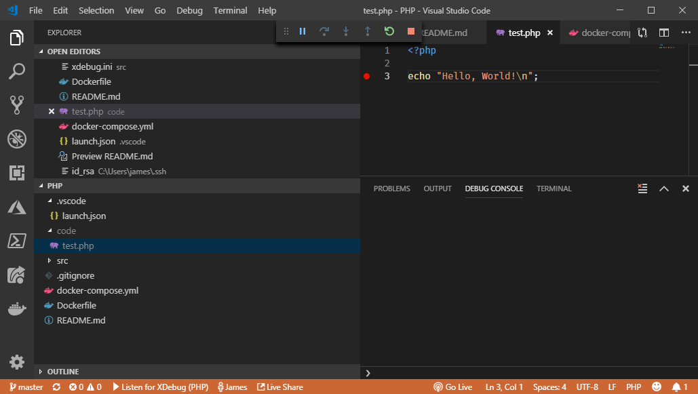

# PHP Learning Container

This repo contains a PHP 7.2 + Apache container that installs XDebug and enables remote debugging from Visual Studio Code with the PHP Debug extension installed. The `.vscode` folder contains launch config to work with this extension.

By default, PHP scripts added to a `code` folder at the root of this repo can be reached at `http://localhost:8080`. XDebug is configured to call back to the host using the special Docker DNS endpoint `host.docker.internal` which works on Mac and Windows at time of writing. For linux, see the Dockerfile - uncomment and comment as documented for a linux compatible configuration.

So to use:

1. Install PHP Debug extension in your VS Code
2. Create a `code` folder in the root and add code (e.g. `test.php` - see below). Set a breakpoint somewhere.
3. Press F5 to launch the debugger which will start listening on port 9000 for a connection from the container. The first time round, the PHP Debug extension will take a moment to activate - watch for the status bar message at the bottom indicating the plugin is listening. 
4. Run docker-compose up to deploy and start the container, which bind mounts the code folder to the /var/html/www folder.
5. Navigate to `http://localhost:8080/test.php` and observe the breakpoint is hit in VS Code.

## Running scripts directly

The above steps are running PHP through Apache. You can also just open the container and execute php scripts directly `php -f <script name>` - but you will need to add to the `pathMappings` in the `launch.json` file to that the debugger can correctly identity the source code.

To attach to the container, look up the container id with `docker container ps` and then run `docker container -it <id> exec bash` to connect.

## Sample PHP

A sample PHP script to test the debugger:

    <?php

    echo "Hello, World!"

Drop this as `test.php` in the code folder and set a breakpoint (F9) on the `echo` line. When you hit `http://localhost:8080/test.php` the breakpoint should be hit.
